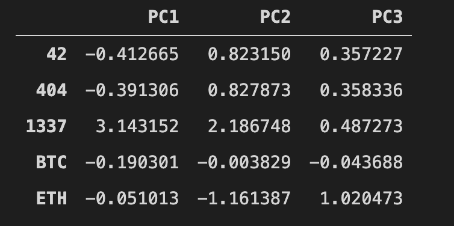
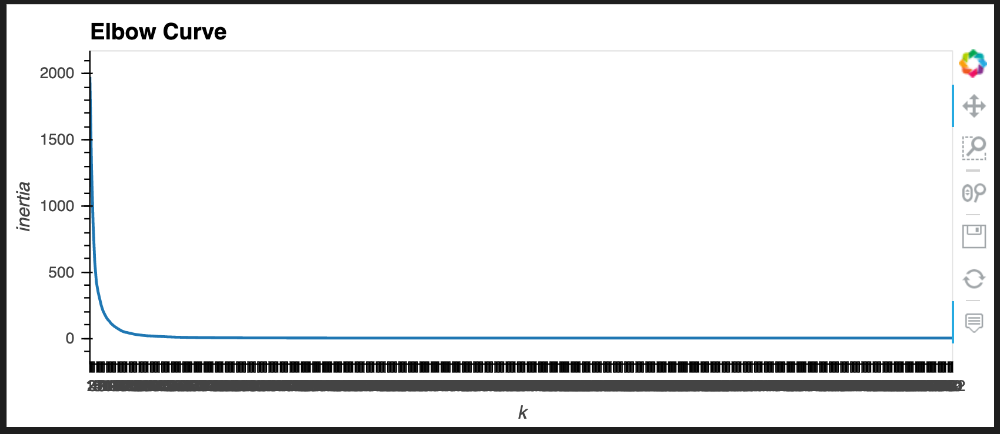
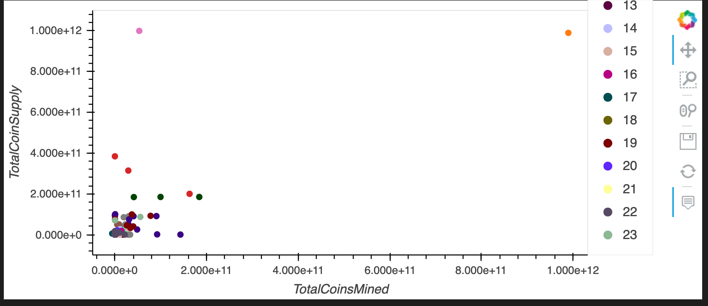
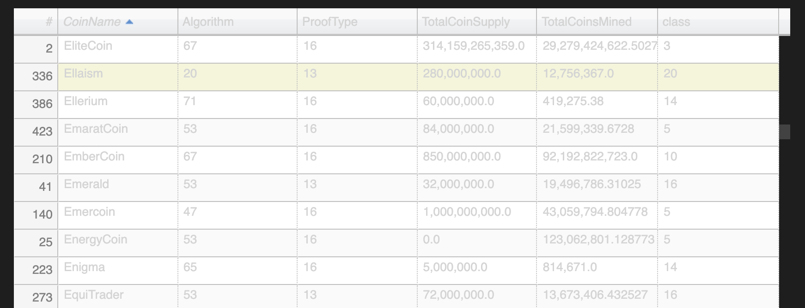

# Cryptocurrencies
Unsupervised Learning to evaluate Cryptocurrency Companies and determine potential investment opportunities.

*The following were utilized and generated:*

### Primary Component Analysis

### Clustering with K-Means to generate:
Elbow Curve

### Scatter plot 

### 3D plot

### Sortable Plot table

Data clean up, modeling, and visualization result in an interactive 3D chart, 2D scatter plot, and sortable table for further investor analysis.