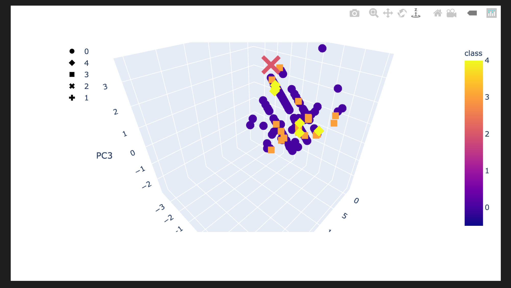

# Cryptocurrencies
Utilized Unsupervised Learning: Cryptocurrency Companies were evaluated to determine potential investment opportunities.
The following were utilized:

### Primary Component Analysis
### Kmeans
### Clustering
### Elbow Curve

### Scatter plot 

### 3D plot

### Sortable Plot table

Data clean up, modeling, and visualization result in an interactive 3D chart, 2D scatter plot, and sortable table for further investor analysis.